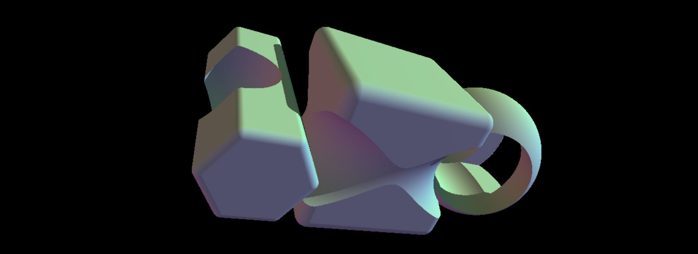
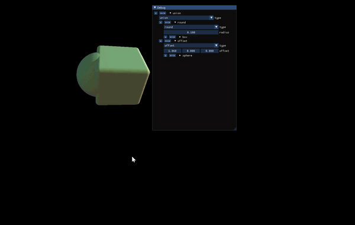

# steply

SDF math library - for rendering stuff with SDF functions.
future plan: make it run in WASM

## purpose
1. Experiment with C++20 modules
2. Play with rendering via composite SDF Math
3. Experiment with std::variant<> for polymorphic fun!

This library makes use of C++ 20 Modules, which are a great new(er) feature of c++. It also is a though experiment about using std::variant for making recursive, generic structures, rather than a virtual interface on a base class. Lastly, Rendering images with signed distance math is just plain fun! It has a lot of interesting differences vs. what I am used to - which is just long lists of triangles.
## build?
for now, use Visual studio 2022, c++20. This repo should be buildable by way of Clang -std=c++20 -fmodules, but I haven't made that work yet, since you have to type a bunch of stuff, wheras visual studio just makes it work
